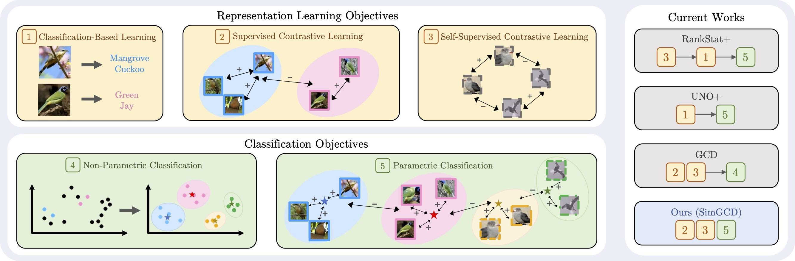

# Parametric Classification for Generalized Category Discovery: A Baseline Study


<p align="center">
    <a href="https://openaccess.thecvf.com/content/ICCV2023/html/Wen_Parametric_Classification_for_Generalized_Category_Discovery_A_Baseline_Study_ICCV_2023_paper.html"></a>
    <a href="https://arxiv.org/abs/2211.11727"></a>
    <a href="https://wen-xin.info/simgcd"></a>
  <a href="https://github.com/CVMI-Lab/SlotCon/blob/master/LICENSE"></a>
</p>
<p align="center">
	Parametric Classification for Generalized Category Discovery: A Baseline Study (ICCV 2023)<br>
  By
  <a href="https://wen-xin.info">Xin Wen</a>*, 
  <a href="https://bzhao.me/">Bingchen Zhao</a>*, and 
  <a href="https://xjqi.github.io/">Xiaojuan Qi</a>.
</p>



Generalized Category Discovery (GCD) aims to discover novel categories in unlabelled datasets using knowledge learned from labelled samples.
Previous studies argued that parametric classifiers are prone to overfitting to seen categories, and endorsed using a non-parametric classifier formed with semi-supervised $k$-means.

However, in this study, we investigate the failure of parametric classifiers, verify the effectiveness of previous design choices when high-quality supervision is available, and identify unreliable pseudo-labels as a key problem. We demonstrate that two prediction biases exist: the classifier tends to predict seen classes more often, and produces an imbalanced distribution across seen and novel categories. 
Based on these findings, we propose a simple yet effective parametric classification method that benefits from entropy regularisation, achieves state-of-the-art performance on multiple GCD benchmarks and shows strong robustness to unknown class numbers.
We hope the investigation and proposed simple framework can serve as a strong baseline to facilitate future studies in this field.

## Running

### Dependencies

```
pip install -r requirements.txt
```

### Config

Set paths to datasets and desired log directories in ```config.py```


### Datasets

We use fine-grained benchmarks in this paper, including:

* [The Semantic Shift Benchmark (SSB)](https://github.com/sgvaze/osr_closed_set_all_you_need#ssb) and [Herbarium19](https://www.kaggle.com/c/herbarium-2019-fgvc6)

We also use generic object recognition datasets, including:

* [CIFAR-10/100](https://pytorch.org/vision/stable/datasets.html) and [ImageNet-100/1K](https://image-net.org/download.php)


### Scripts

**Train the model**:

```
bash scripts/run_${DATASET_NAME}.sh
```

We found picking the model according to 'Old' class performance could lead to possible over-fitting, and since 'New' class labels on the held-out validation set should be assumed unavailable, we suggest not to perform model selection, and simply use the last-epoch model.

## Results
Our results:

<table><thead><tr><th>Source</th><th colspan="3">Paper (3 runs) </th><th colspan="3">Current Github (5 runs) </th></tr></thead><tbody><tr><td>Dataset</td><td>All</td><td>Old</td><td>New</td><td>All</td><td>Old</td><td>New</td></tr><tr><td>CIFAR10</td><td>97.1±0.0</td><td>95.1±0.1</td><td>98.1±0.1</td><td>97.0±0.1</td><td>93.9±0.1</td><td>98.5±0.1</td></tr><tr><td>CIFAR100</td><td>80.1±0.9</td><td>81.2±0.4</td><td>77.8±2.0</td><td>79.8±0.6</td><td>81.1±0.5</td><td>77.4±2.5</td></tr><tr><td>ImageNet-100</td><td>83.0±1.2</td><td>93.1±0.2</td><td>77.9±1.9</td><td>83.6±1.4</td><td>92.4±0.1</td><td>79.1±2.2</td></tr><tr><td>ImageNet-1K</td><td>57.1±0.1</td><td>77.3±0.1</td><td>46.9±0.2</td><td>57.0±0.4</td><td>77.1±0.1</td><td>46.9±0.5</td></tr><tr><td>CUB</td><td>60.3±0.1</td><td>65.6±0.9</td><td>57.7±0.4</td><td>61.5±0.5</td><td>65.7±0.5</td><td>59.4±0.8</td></tr><tr><td>Stanford Cars</td><td>53.8±2.2</td><td>71.9±1.7</td><td>45.0±2.4</td><td>53.4±1.6</td><td>71.5±1.6</td><td>44.6±1.7</td></tr><tr><td>FGVC-Aircraft</td><td>54.2±1.9</td><td>59.1±1.2</td><td>51.8±2.3</td><td>54.3±0.7</td><td>59.4±0.4</td><td>51.7±1.2</td></tr><tr><td>Herbarium 19</td><td>44.0±0.4</td><td>58.0±0.4</td><td>36.4±0.8</td><td>44.2±0.2</td><td>57.6±0.6</td><td>37.0±0.4</td></tr></tbody></table>

## Citing this work

If you find this repo useful for your research, please consider citing our paper:

```
@inproceedings{wen2023simgcd,
    author    = {Wen, Xin and Zhao, Bingchen and Qi, Xiaojuan},
    title     = {Parametric Classification for Generalized Category Discovery: A Baseline Study},
    booktitle = {Proceedings of the IEEE/CVF International Conference on Computer Vision (ICCV)},
    year      = {2023},
    pages     = {16590-16600}
}
```

## Acknowledgements

The codebase is largely built on this repo: https://github.com/sgvaze/generalized-category-discovery.

## License

This project is licensed under the MIT License - see the [LICENSE](LICENSE) file for details.
